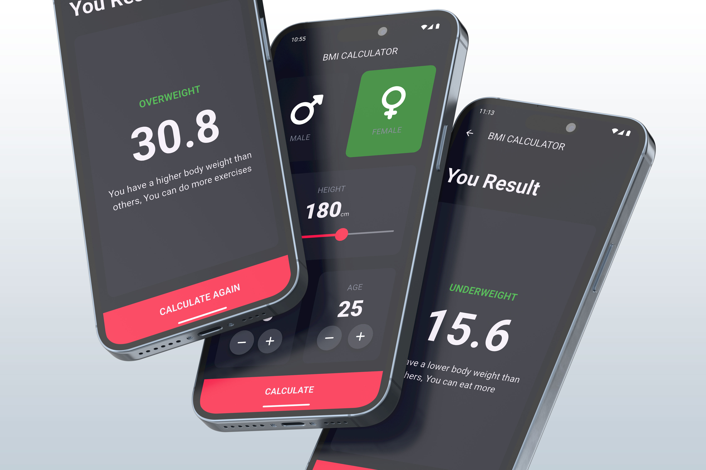
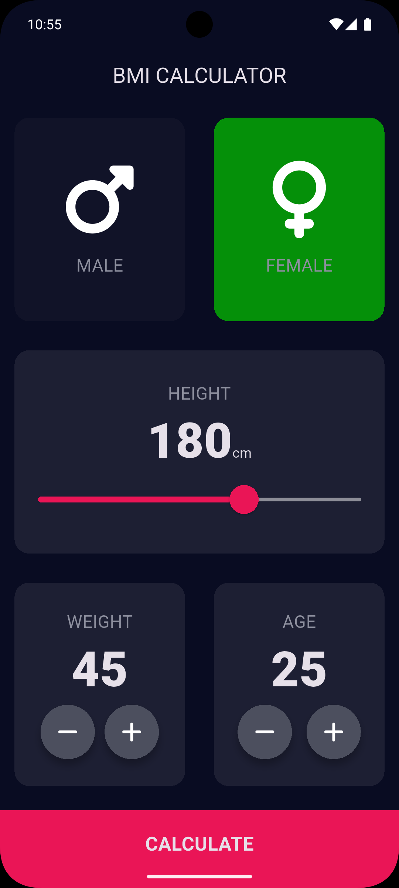
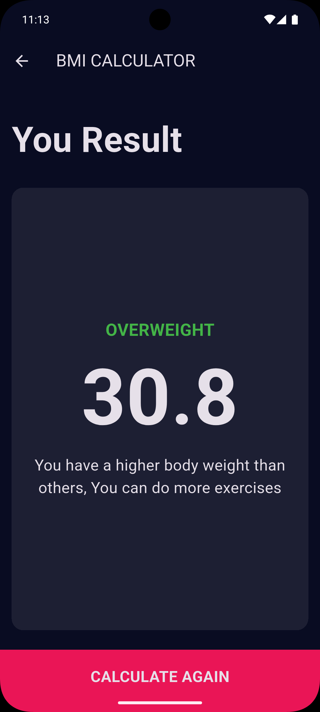

# BMI CALCULATOR



A clean and intuitive **BMI Calculator** app developed using **Flutter**.  
The application features a **simple user interface**, **minimal interaction buttons**, and a **responsive design with dynamic color themes**. It calculates your Body Mass Index based on height and weight, then displays the result with a health interpretation.

---

## Screenshots

<div align="center">
   
  
</div>

---

## Features

- Interactive sliders for height and weight input
- Gender and age selection (if applicable)
- Clean and minimal design focused on user experience
- Real-time BMI calculation
- Health suggestion based on BMI value
- Responsive layout for multiple screen sizes

---

## Getting Started

### Prerequisites

Ensure Flutter is installed on your system.  
To verify installation, run:

```bash
flutter doctor
```

---

## Running the App

### Clone the Repository

```bash
git clone https://github.com/yourusername/bmi-calculator.git
cd bmi-calculator
```

### Get Dependencies

```bash
flutter pub get
```

### Run the App

```bash
flutter run
```

---

## Building for Android

To build a release APK:

```bash
flutter build apk --release
```

The APK file will be available at:

```
build/app/outputs/flutter-apk/app-release.apk
```

---

## Building for iOS

Ensure you are on macOS and have Xcode installed:

```bash
flutter build ios --release
```

> Note: iOS builds require a valid Apple Developer account and a configured provisioning profile.

---

## License

This project is provided for educational purposes.  

